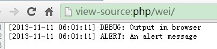

Logger
======

记录日志到文件中

案例
----

### 记录一条DEBUG级别的日志

```php
wei()->logger->debug('The logger is called');

// 输出日志文件的路径
echo wei()->logger->getFile();

// 可以在日志文件看到类似格式的一条日志
// [XX:XX:XX] DEBUG: The logger is called
```

### 直接输出日志到浏览器

为了快速调试,有时我们需要把日志打印在浏览器上,只需简单配置文件路径即可.

```php
wei(array(
    'logger' => array(
        'file' => 'php://output' // 配置输出的文件为'php://output'
        'fileDetected' => true,  // 表示文件路径已经指定,不用再去检测获取
    )
));

wei()->logger->debug('Output in browser');
wei()->logger->alert('An alert message');
```

输出结果




### 将请求URL地址等信息附加到每条日志中

```php
$logger = wei()->logger;

// 附加一项信息到日志中
$logger->setContext('reqUrl', wei()->request->getUrl());

// 附加多项信息到日志中
$logger->setContext(array(
    'clientIp' => wei()->request->getIp(),
    'serviceIp' => $_SERVER['SERVER_ADDR']
));

$logger->info(sprintf('User %s logined.', 'twin'));
```

**输出结果**

```
[05:56:16] INFO: User twin logged in.
Array
(
    [clientIp] => 127.0.0.1
    [serviceIp] => 127.0.0.1
    [reqUrl] => http://localhost/index.php
)
````

调用方式
--------

### 选项

名称         | 类型   | 默认值                            | 说明
-------------|--------|-----------------------------------|------
name         | string | wei                               | 日志的名称,可以每个模块设定一个名称进行区分
level        | string | debug                             | 默认的日志级别
handledLevel | string | debug                             | 记录到文件的最低日志等级,低于该等级的日志将不记录到文件中
format       | string | [%datetime%] %level%: %message%\n | 日志的格式
dateFormat   | string | H:i:s                             | 日志中日期的格式,使用[date](http://php.net/manual/en/function.date.php)函数转换
dir          | string | log                               | 日志文件的目录
fileFormat   | string | Ymd.\l\o\g                        | 日志文件名称的格式
fileSize     | int    | 134217728                         | 日志文件最大容量,单位是字节,默认是128mb,设为0表示不限制大小
file         | string | 无                                | 日志文件的路径,留空表示根据`dir`,`fileFormat`和`fileSize`选项生成,不留空的话需设置`fileDetected`才有效
fileDetected | bool   | false                             | 日志文件路径是否已确认,与`file`选项搭配使用
context      | array  | array()                           | 附加到每条日志的默认内容,如用户IP地址,请求URL地址等

#### 日志等级及使用场景

名称      | 级别 | 使用场景
----------|------|-----------
debug     | 低   | 具体的调试信息,如某个函数被调用了,某个参数的值,主要用于调试
info      | 低   | 有用的信息,如某某用户登录了,SQL日志
warning   | 中   | 个别情况出现的信息,例如使用废弃的接口,接口使用场景错误,配置错误
error     | 中   | 运行中的错误,不需要马上处理,但应该被记录及监控,如邮件发送失败
critical  | 高   | 严重的情况,如某个组件不可用,未捕获的异常
alert     | 高   | 必须马上处理的情况,如网站打不开,数据库连不上,这种情况下应该发送短信通知你处理!

日志等级及说明来自于[Monolog](https://github.com/Seldaek/monolog) 

除了上面之外,还有notice和emergency级别,因不推荐使用,且为避免混淆,不一一详细说明.

### 方法

#### logger($level, $message)
记录一条日志

#### logger->debug($message)
记录一条DEBUG等级的日志

#### logger->info($message)
记录一条info等级的日志

#### logger->warning($message)
记录一条warning等级的日志

#### logger->error($message)
记录一条error等级的日志

#### logger->critical($message)
记录一条critical等级的日志

#### logger->alert($message)
记录一条alert等级的日志

#### logger->getFile()
获取日志文件

#### logger->setLevel($level)
设置默认的日志等级

#### logger->setHandledLevel($level)
设置记录的最低日志等级

#### logger->setContext($name, $value)
设置一项日志附加信息

#### logger->setContext(array $context)
设置多项日志附加信息

#### logger->clean()
删除日志目录下的所有文件(注意谨慎使用)