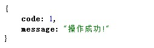
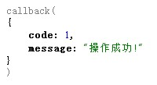
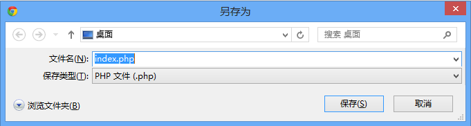

Response
========

发送HTTP响应头和响应内容

案例
----

### 发送内容为"Hello World"的HTTP响应

```php
wei()->response('Hello World');

// 运行结果
'Hello World'
```

### 获取上面案例中HTTP响应的完整内容

```php
echo (string)wei()->response;

// 运行结果
'HTTP/1.1 200 OK

Hello World'
```

### 输出JSON格式的数据

```php
wei()->response(array(
    'code' => 1,
    'message' => '操作成功!'
));

// 运行结果
'{"code":1,"message":"\u64cd\u4f5c\u6210\u529f!"}'
```

结果截图:



### 输出JSONP格式的数据

```php
wei()->response->jsonp(array(
    'code' => 1,
    'message' => '操作成功!'
));

// 假设URL请求地址为 index.php?callback=callback,运行结果为
'callback({"code":1,"message":"\u64cd\u4f5c\u6210\u529f!"})'
```

结果截图:



> #### 注意
> 
> 只要符合正则`/^[$A-Z_][0-9A-Z_$.]*$/i`都会认为是合法的`callback`值.

### 等待3秒后跳转到谷歌首页

```php
wei()->response->redirect('http://www.google.com', 302, array(
    'redirectWait' => 3
));
```

### 直接跳转到谷歌首页

```php
wei()->response->redirect('http://www.google.com');
```

### 自定义跳转视图

设置全局跳转视图文件

```php
wei(array(
    'response' => array(
        'redirectView' => 'path/to/redirect.php'
    )
));
```

文件`path/to/redirect.php`

```html
<!DOCTYPE html>
<html>
  <head>
    <meta charset="utf-8">
    <meta http-equiv="refresh" content="<?= $wait ?>;url=<?= $escapedUrl ?>">
    <title>正在跳转到 <?= $escapedUrl ?></title>
  </head>
  <body>
    <h1>跳转到<a href="<?= $escapedUrl ?>"><?= $escapedUrl ?></a></h1>
  </body>
</html>
```

### 让浏览器弹出下载对话框,下载指定的文件

```php
wei()->response->download(__FILE__);
```

结果截图:



### 逐个打印1-10的数字到浏览器窗口,每隔一秒输出一个

```php
// 关闭缓冲区,发送HTTP响应等
wei()->response->flush();

for ($i = 1; $i <= 10; $i++) {
    echo $i;
    sleep(1);
}
```

调用方式
--------

### 选项

名称           | 类型      | 默认值    | 说明
---------------|-----------|-----------|------
version        | string    | 1.1       | HTTP版本
statusCode     | int       | 200       | HTTP状态码
statusText     | string    | OK        | HTTP状态消息
content        | string    | 无        | HTTP响应内容
isSent         | bool      | false     | HTTP响应内容是否已发送
cookieOption   | array     | 见下表    | 设置cookie的相关选项
downloadOption | array     | 见下表    | 调用`download`方法的相关选项
redirectView   | string    | 无        | 自定义跳转视图的文件,可以设置该选项以展示更加友好的跳转视图
redirectWait   | int       | 0         | 等待跳转的秒数,如果wait为0,使用的是HTTP header跳转,如果不为0,因为HTTP header不支持延迟跳转,所以使用的是HTML [Meta refresh](http://en.wikipedia.org/wiki/Meta_refresh)跳转
beforeSend     | callable  | 无        | 在发送响应前调用的回调
afterSend      | callable  | 无        | 在发送响应后调用的回调

#### 选项: cookieOption

名称      | 类型      | 默认值    | 说明
----------|-----------|-----------|------
expires   | int       | 86400     | cookie相对于现在的过期秒数
path      | string    | /         | cookie活动的路径
domain    | string    | null      | 保存该cookie的域名
secure    | bool      | false     | 是否只通过HTTPS安全连接来发送,只有在HTTPS连接下才有效
httpOnly  | bool      | false     | 是否只通过HTTP协议发送cookie,如果是,客户端javascript将无法读取到该cookie
raw       | bool      | false     | 是否发送为不经过URL解码的cookie

#### 选项: downloadOption

名称          | 类型   | 默认值                 | 说明
--------------|--------|------------------------|------
filename      | string | null                   | 弹出下载对话框时显示的文件名称
type          | string | application/x-download | 指定HTTP内容类型（Content-Type）
disposition   | string | attachment             | 下载的方式,可选项为`inline`或`attachment`,如果是`inline`,浏览器会先尝试直接在浏览器中打开,如果是`attachment`,浏览器将直接弹出下载对话框

#### 回调: beforeSend($response, $content)

名称        | 类型            | 说明
------------|-----------------|------
$response   | Wei\Response | 当前HTTP响应对象
$content    | string          | 发送响应的内容

#### 回调: afterSend($response)

名称        | 类型            | 说明
------------|-----------------|------
$response   | Wei\Response | 当前HTTP响应对象

### 方法

#### response($content, $status = null)
发送HTTP响应头和响应内容

名称          | 类型      | 默认值    | 说明
--------------|-----------|-----------|------
$content      | string    | 无        | HTTP响应的内容
$stateCode    | int       | 200       | HTTP响应的状态码

#### response->setContent($content)
设置HTTP响应的内容

#### response->getContent()
获取HTTP响应的内容

#### response->setStatusCode($code, $text = null)
设置HTTP响应的状态码

#### response->setStatusCode()
获取HTTP响应的状态码

#### response->isSent()
检查内容是否已发送

#### response->setSentStatus($bool)
设置内容是否已发送

#### response->download($file, $downloadOptions = array())
下载指定的文件

#### response->flush($content = null, $status = null)
关闭缓冲区,让后台脚本实时输出内容到浏览器

#### response->json($data)
输出JSON格式的数据到浏览器

#### response->jsonp($data)
输出JSON或JSONP格式的数据到浏览器

#### response->redirect($url, $statusCode = 302, $options)
跳转到指定的网址